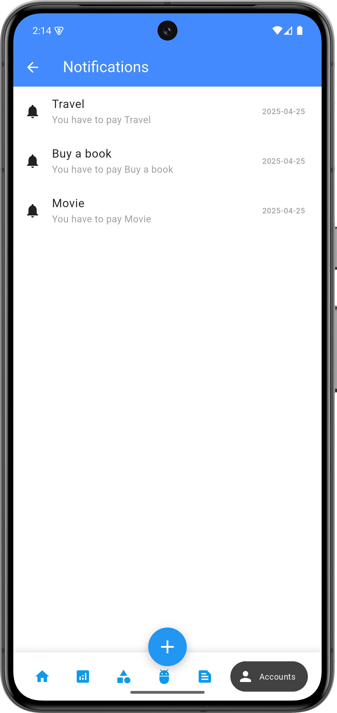

## 1. Cài đặt môi trường
- SDK: 35
- Gradle 8.4

## 2. Run in terminal: 
```
  flutter clean
  flutter pub get
  cd android
  .\gradlew clean build
  ```

## 3. Screenshot
| Home                                         | Expense                                   | Category Management                        | Profile                                  |
|----------------------------------------------|-------------------------------------------|--------------------------------------------|------------------------------------------|
|            |   |  |  |

| Notifications                                | Signup                                    | Signin                                    | Login                                    |
|----------------------------------------------|-------------------------------------------|-------------------------------------------|------------------------------------------|
|  |    |     |      |

| Add Transaction                              | Add Category                               | AI Chat                                    | Plan                                     |
|----------------------------------------------|-------------------------------------------|-------------------------------------------|------------------------------------------|
|  |  |   |       |

<!-- Row 1 -->
<div style="display: flex; overflow-x: auto; gap: 10px; padding: 10px 0;">
  <div>
    <p>Home</p>
    
  </div>
  <div>
    <p>Expense</p>
    
  </div>
  <div>
    <p>Categories</p>
    
  </div>
  <div>
    <p>Profile</p>
    
  </div>
  <div>
    <p>Notifications</p>
    
  </div>
  <div>
    <p>Signup</p>
    
  </div>
  <div>
    <p>Signin</p>
    
  </div>
  <div>
    <p>Login</p>
    
  </div>
  <div>
    <p>Add Transaction</p>
    
  </div>
  <div>
    <p>Add Category</p>
    
  </div>
</div>

<!-- Row 2 -->
<div style="display: flex; overflow-x: auto; gap: 10px; padding: 10px 0;">
  <div>
    <p>AI Chat</p>
    
  </div>
  <div>
    <p>Plan</p>
    
  </div>
</div>
## 4. Xử lý lỗi: 
- Nếu source nằm trên ổ C và project nằm trên ổ D và gặp lỗi như sau:``` 
    PS D:\Workspace\flutter\MyFinance_Management\android> .\gradlew clean build
    Configure project :gradle
    WARNING: Unsupported Kotlin plugin version.
    The `embedded-kotlin` and `kotlin-dsl` plugins rely on features of Kotlin `1.9.10` that might work differently than in the requested version `1.9.20`.
    WARNING: We recommend using a newer Android Gradle plugin to use compileSdk = 35
    This Android Gradle plugin (8.2.1) was tested up to compileSdk = 34.
    You are strongly encouraged to update your project to use a newer
    Android Gradle plugin that has been tested with compileSdk = 35.
    If you are already using the latest version of the Android Gradle plugin,
    you may need to wait until a newer version with support for compileSdk = 35 is available.
    To suppress this warning, add/update android.suppressUnsupportedCompileSdk=35 to this project's gradle.properties.
    FAILURE: Build failed with an exception.
        * What went wrong:
          Could not determine the dependencies of task ':path_provider_android:test'.
        >   Could not create task ':path_provider_android:testProfileUnitTest'.
        >   this and base files have different roots: D:\Workspace\flutter\MyFinance_Management\build\path_provider_android and C:\Users\haing\AppData\Local\Pub\Cache\hosted\pub.dev\path_provider_android-2.2.15\android.
        * Try:
        >   Run with --stacktrace option to get the stack trace.
        >   Run with --info or --debug option to get more log output.
        >   Run with --scan to get full insights.
        >   Get more help at https://help.gradle.org.
        BUILD FAILED in 3s
        6 actionable tasks: 1 executed, 5 up-to-date
        PS D:\Workspace\flutter\MyFinance_Management\android>```
- Xử lý lỗi:
  - Tạo một thư mục mới trong ổ D: ```D:\FlutterPubCache```
  - Thêm biến môi trường: 
    - Nhấn **Windows + S**, tìm **Environment Variables** 
    - Chọn Environment Variables... 
    - Ở mục **User variables**, nhấn **New...** 
    - Variable name: ```PUB_CACHE``` 
    - Variable value: ```D:\FlutterPubCache```
   


  
